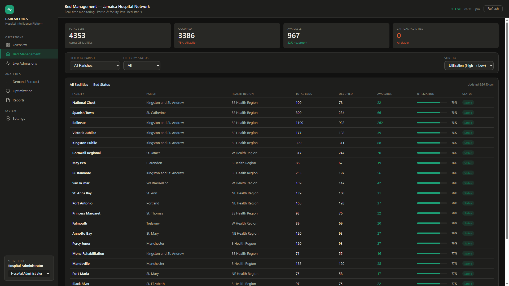

# CareMetrics — Jamaica Hospital Intelligence Platform

A full-stack hospital resource management dashboard for the Jamaican public health network. Built on top of a data science project that uses Prophet forecasting and PuLP optimisation to model patient demand and bed allocation across all public hospitals in Jamaica.

> **Related repository:** [hospital-resource-optimization](https://github.com/datajav/hospital-resource-optimization) — the DS research project this app is built on, including EDA, synthetic data generation, Prophet notebooks, and optimisation analysis.
>> **Live Demo:** [hospital-resource-optimization](https://github.com/datajav/hospital-resource-optimization) — the live demo that you can expirement with is available at the following link. 

---

## Screenshots



---

## Features

**Operations**
- **Overview** — Live system-wide bed metrics, facility utilisation table, active alerts, and a 24h/7d/30d Prophet demand forecast chart
- **Bed Management** — Full filterable and sortable table of all 23 public facilities with real-time occupancy, utilisation bars, and RAG status
- **Live Admissions** — 7-day inflow monitor for ER, ICU, and Maternity departments using Poisson arrival simulation with seasonality controls

**Analytics**
- **Demand Forecast** — Per-facility Prophet `yhat` time series with 95% confidence intervals, scenario multipliers (Normal / Flu Season / Outbreak / Disaster), and a full system forecast summary table
- **Optimization** — PuLP linear programming solver with three layers (Facility / Parish / System), four scenarios, and configurable system reserve. Displays demand vs. assigned vs. overflow per facility

**Reports**
- Export bed status, forecast, admissions, or full system data as CSV with a single click

---

## Tech Stack

| Layer | Technology |
|-------|-----------|
| Frontend | HTML, CSS, Vanilla JS, Chart.js |
| Backend | FastAPI, Python 3.12 |
| Forecasting | Prophet (Meta) |
| Optimisation | PuLP + CBC solver |
| Data | pandas, numpy |
| Containerisation | Docker, Docker Compose |
| Web server | nginx |

---

## Data Science Foundation

The backend services map directly to the DS project notebooks:

| API Endpoint | DS Source |
|---|---|
| `GET /api/beds` | `data/hospitals.csv` |
| `GET /api/inflow` | `src/synthetic_data_creation.py` |
| `GET /api/forecast` | `03_Prophet_Forecasting.ipynb` / `data/forecast_data.csv` |
| `POST /api/optimise` | `04_Optimization.ipynb` (PuLP functions) |

---

## Project Structure

```
hospital-resource-software/
├── backend/
│   ├── main.py                  # FastAPI app
│   ├── models/
│   │   └── pycache.py           # Pydantic models
│   ├── routers/
│   │   ├── beds.py
│   │   ├── forecast.py
│   │   ├── inflow.py
│   │   └── optimise.py
│   └── services/
│       ├── hospitals.py         # hospitals.csv parser
│       ├── inflow.py            # Poisson arrival logic
│       ├── forecaster.py        # Prophet wrapper
│       └── optimizer.py        # PuLP functions
├── frontend/
│   └── jamaica_health_ops_dashboard.html
├── Dockerfile.backend
├── Dockerfile.frontend
├── docker-compose.yml
├── nginx.conf
├── requirements.txt
└── .env
```

---

## Getting Started

### Prerequisites
- [Docker Desktop](https://www.docker.com/products/docker-desktop/)
- The DS data folder from [hospital-resource-optimization](https://github.com/Javaughn/hospital-resource-optimization)

### Setup

**1. Clone the repo**
```bash
git clone https://github.com/Javaughn/hospital-resource-software.git
cd hospital-resource-software
```

**2. Configure your data path**

Open `.env` and set the path to your DS data folder:
```
DS_DATA_PATH=C:/Users/YourName/path/to/hospital-resource-optimization/data
```

**3. Build and run**
```bash
docker-compose up --build
```

**4. Open the dashboard**

- Dashboard: [http://localhost:3000/jamaica_health_ops_dashboard.html](http://localhost:3000/jamaica_health_ops_dashboard.html)
- API docs: [http://localhost:8000/docs](http://localhost:8000/docs)

### Daily workflow
```bash
docker-compose up       # start
docker-compose down     # stop
```

> Only run `--build` again if you modify `requirements.txt`.

---

## API Endpoints

| Method | Endpoint | Description |
|--------|----------|-------------|
| `GET` | `/health` | Health check |
| `GET` | `/api/beds` | Live bed counts for all facilities |
| `POST` | `/api/beds/simulate-tick` | Advance occupancy simulation |
| `GET` | `/api/forecast` | Prophet demand forecast per facility |
| `GET` | `/api/inflow` | Poisson inflow by facility and date range |
| `POST` | `/api/optimise` | Run PuLP bed allocation solver |

Full interactive docs available at `/docs` when the server is running.

---

## Updating the App

| Change | Action needed |
|--------|--------------|
| Edit HTML/CSS/JS in `frontend/` | Refresh browser — changes are live immediately |
| Edit Python files in `backend/` | `docker-compose down && docker-compose up --build` |
| Add new Python packages | Update `requirements.txt`, then rebuild |

---

## Acknowledgements

- Hospital data sourced from Jamaica's public health facility registry
- Forecasting powered by [Prophet](https://facebook.github.io/prophet/)
- Optimisation powered by [PuLP](https://coin-or.github.io/pulp/)
